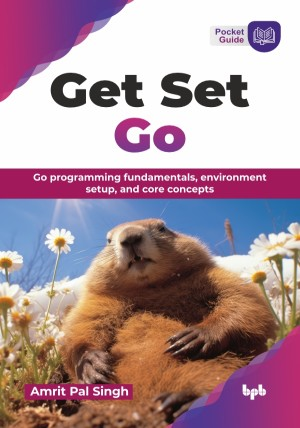

# Get Set Go

Go programming fundamentals, environment setup, and core concepts.

This is the repository for [Get Set Go
](https://bpbonline.com/products/get-set-go?variant=44629099020488),published by BPB Publications.

## About the Book
Go, a modern programming language renowned for its efficiency and concurrency, empowers developers to build scalable and robust applications. Get Set Go is your practical guide to learn this powerful technology, designed to take you from foundational concepts to advanced development techniques with clarity and ease.  

This book systematically guides you through the essentials, starting with setting up your Go environment and writing your first programs, while understanding Go modules and basic output. You will then explore core language elements like diverse data types, control structures, functions, and effective error handling. Progressing further, you will learn to manipulate strings and files, delve into the intricacies of Go's reflection capabilities, and harness the power of concurrency with goroutines and channels. You will gain expertise in structuring applications using structs, methods, and interfaces, build web applications with JSON and HTTP, ensure code reliability through logging and testing, and venture into modern web development practices and distributed systems. Finally, you will also unlock the potential of generics for writing reusable code and learn to secure your Go applications with cryptography.

By the end of Get Set Go, you will possess a comprehensive understanding of Go programming, equipped with the skills and confidence to develop a wide range of applications, from efficient system tools to scalable web services and beyond.

## What You Will Learn
• Write efficient, maintainable, and testable Go code.

• Set up Go, manage modules, and output formatted text.

• Master Go's data types and control flow structures.

• Define functions and implement Go's error handling.

• Work with strings and perform essential file operations.

• Build web applications and REST APIs with the net/http package. 

• Structure data with structs, methods, and interfaces.
